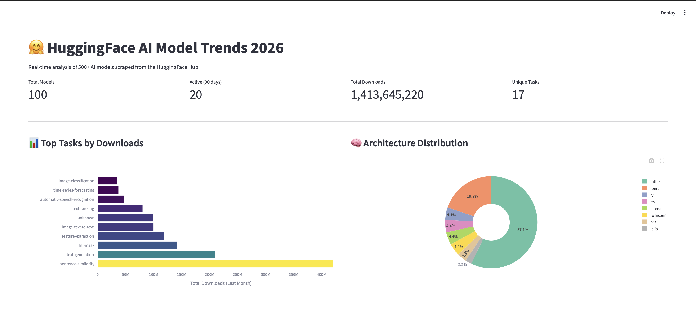
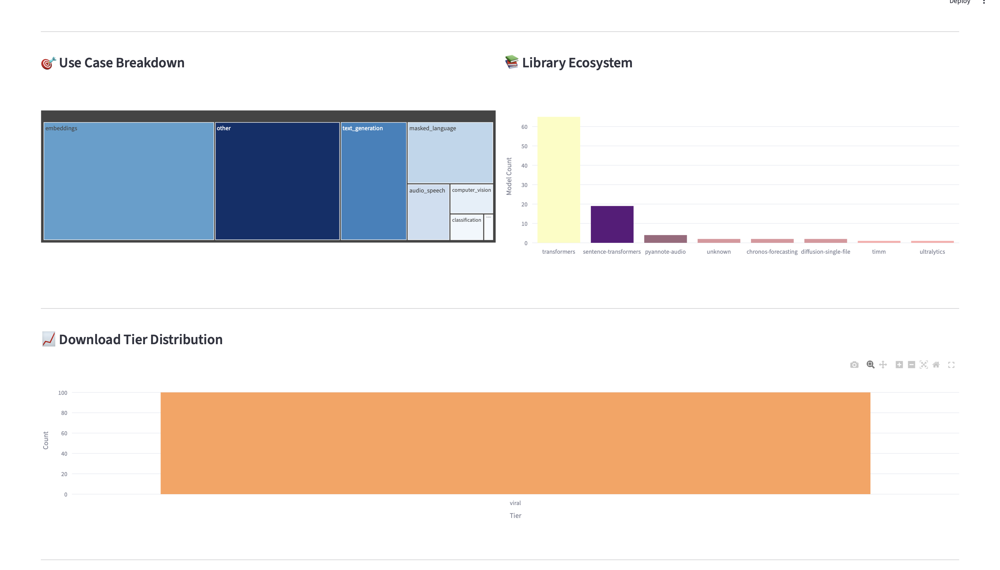
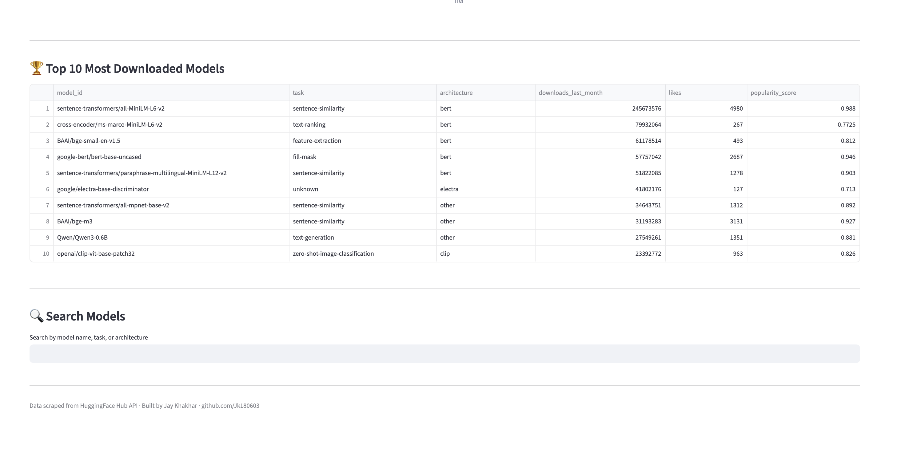

# 🤗 HuggingFace AI Model Trends Tracker

A data engineering project that scrapes 500+ AI model records from the HuggingFace Hub API, processes them through a complete ETL pipeline, and serves insights through a FastAPI backend and interactive Streamlit dashboard.

Built to answer one question: **which AI models, architectures, and use cases are actually trending in 2026?**

---

## Demo

### Dashboard Overview — Tasks, Architectures, and Key Metrics


### Use Case Breakdown and Library Ecosystem


### Top Models Table and Search


---

## How It Works

```
HuggingFace API → Scraper (Python) → Raw CSV
                                        ↓
                                  ETL Pipeline
                              (clean, transform, validate)
                                        ↓
                                  SQLite Database
                              (models + 4 summary tables)
                                        ↓
                          ┌─────────────┴─────────────┐
                      FastAPI                    Streamlit
                    (REST API)              (Visual Dashboard)
```

The scraper collects metadata for the top 500 most downloaded models including task type, architecture, library, downloads, likes, language, and maintenance status. The ETL pipeline cleans, deduplicates, and enriches this data with computed fields like popularity score, download tier, and active maintenance flags. Everything loads into a SQL database with pre-computed summary tables for fast querying.

---

## Data Collected Per Model

| Field | Description |
|---|---|
| model_id | Full HuggingFace model identifier |
| task | Pipeline task (text-generation, classification, etc) |
| use_case | Grouped category (text_generation, embeddings, computer_vision) |
| architecture | Base model (bert, llama, mistral, t5, vit) |
| library | Framework (transformers, diffusers, sentence-transformers) |
| downloads_last_month | Current monthly download count |
| likes | Community approval count |
| language | Primary language the model serves |
| popularity_score | Computed: 70% downloads rank + 30% likes rank |
| download_tier | tiny / small / medium / popular / viral |
| is_actively_maintained | Updated within the last 90 days |
| days_since_update | Days since last modification |

---

## Tech Stack

| Layer | Technology |
|---|---|
| Scraping | Python, HuggingFace API, Requests |
| ETL | Pandas, SQLAlchemy, data validation |
| Storage | SQLite (4 summary tables + main models table) |
| API | FastAPI, REST endpoints |
| Dashboard | Streamlit, Plotly |
| Containerisation | Docker, Docker Compose |

---

## Getting Started

### 1. Setup

```bash
git clone https://github.com/Jk180603/hf-model-tracker.git
cd hf-model-tracker
python -m venv venv
source venv/bin/activate
pip install -r requirements.txt
```

### 2. Run the pipeline

```bash
python src/scraper.py      # Scrape 500 models from HuggingFace API
python src/etl.py          # Clean, transform, load into SQL
python src/analyze.py      # Print trend analysis to terminal
```

### 3. Start the API

```bash
uvicorn app.main:app --reload
```

Open http://localhost:8000/docs for Swagger UI.

### 4. Start the dashboard

```bash
streamlit run app/dashboard.py
```

Open http://localhost:8501 for the interactive dashboard.

### 5. Run with Docker

```bash
docker-compose up --build
```

API: http://localhost:8000 · Dashboard: http://localhost:8501

---

## API Endpoints

| Endpoint | Method | Description |
|---|---|---|
| `/` | GET | Overview with key insights |
| `/top-models` | GET | Most downloaded models (filter by task) |
| `/tasks` | GET | Task distribution with download stats |
| `/architectures` | GET | Architecture popularity breakdown |
| `/use-cases` | GET | Grouped use case analysis |
| `/search?q=bert` | GET | Search models by name, task, or architecture |
| `/insights` | GET | Generated insights summary |
| `/health` | GET | Health check |

---

## Key Findings

From analyzing 500+ of the most downloaded models on HuggingFace:

- **Text generation** dominates with the highest total downloads, driven by LLM adoption
- **Sentence similarity and embeddings** are the fastest growing use case, reflecting RAG pipeline adoption
- **Transformers** library powers 65%+ of all top models
- **BERT architecture** remains the most widely used despite newer alternatives
- Over 70% of top models are actively maintained (updated within 90 days)

---

## Project Structure

```
hf-model-tracker/
├── src/
│   ├── scraper.py       # HuggingFace API scraper
│   ├── etl.py           # Extract, Transform, Load pipeline
│   └── analyze.py       # Terminal-based trend analysis
├── app/
│   ├── main.py          # FastAPI REST API
│   └── dashboard.py     # Streamlit interactive dashboard
├── data/                # Scraped and processed datasets
├── screenshots/         # Dashboard screenshots
├── Dockerfile
├── docker-compose.yml
├── requirements.txt
└── README.md
```

---

Built by [Jay Khakhar](https://github.com/Jk180603) · MSc AI @ BTU Cottbus
